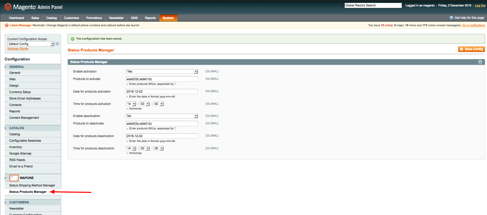

# WaPoNe_StatusProductsManager
A Magento extension to schedule products enabling/disabling

##Installation

1. Login into the backend, go to System — Cache Management and enable all types of cache.
2. Go to System — Tools — Compilation and make sure compilation is disabled.
3. Connect to your website source folder with FTP/SFTP/SSH and upload all the extension files and folders from master folder of the extension package (except doc folder and README.md file) to the root folder of your Magento installation.
Please use the “Merge” upload mode. Do not replace the whole folders, but merge them. This way your FTP/SFTP client will only add new files.
4. Go to System — Cache Management page under Magento backend and click “Flush Cache Storage” button. After this action, the extension is installed.
5. If you need to enable compilation, you can do it now at System — Tools — Compilation.
6. Please log out of the backend and log in again, so Magento can refresh permissions.

## User Guide

**This extension enable/disable products changing 'product status attribute' so the product will be enabled/disabled for all the store views configured **

### Enabling products

1. Go to System - Configuration - WaPoNe - Status Products Manager.

2. Set to 'Yes' *Enabling* field if you want to enable shipping methods.
3. Insert products SKUs to enable, separated by ';'.
4. Enter the date and the time when script has to start (cron job *wapone_status_products_manage* runs every five minutes by default).

### Disabling products

1. Go to System - Configuration - WaPoNe - Status Products Manager.
2. Set to 'Yes' *Disabling* field if you want to disable products.
3. Insert products SKUs to disable, separated by ';'.
4. Enter the date and the time when script has to start (cron job *wapone_status_products_manage* runs every five minutes by default).

**After script was executed, _Enabling/Disabling_ field will set to 'No' to avoid it is execute more times**

## Compability

- Magento CE:
  - 1.8.x
  - 1.9.x
